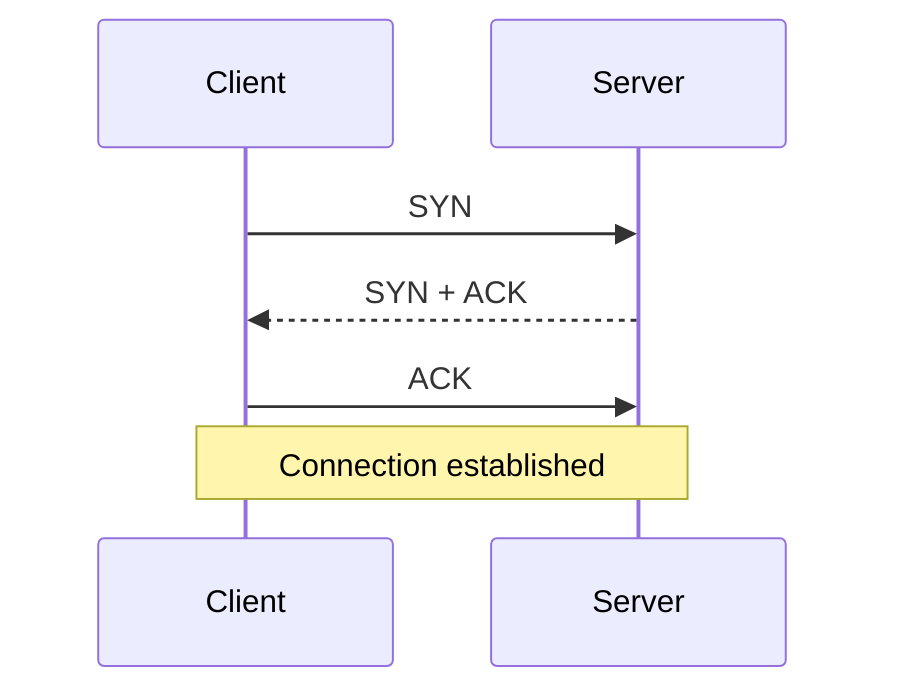

一次后端请求依次经过域名解析、网络路由、端口分发、传输连接、TLS 解密和 HTTP 解析，随后才进入业务代码。理解这条链路用于回答三个实际问题：请求为什么会慢或失败，客户端重试会不会造成重复操作，以及一项安全配置覆盖了哪一层边界。

## 3.1 从分层开始：每层只解决一类问题

网络协议使用分层，是因为“把数据送到远处的程序”包含性质不同的工作。应用层关心业务语义，例如 HTTP 的 `GET /orders/42`；传输层关心两个程序之间如何传输数据，例如 TCP；网际层关心数据包如何从一台机器路由到另一台机器，例如 IP；链路层关心数据怎样在一段本地链路上传输，例如以太网或 Wi-Fi。教材里常见的 OSI 七层模型适合分类；工程上更常按 TCP/IP 的应用、传输、网际、链路四层讨论。两种划分不冲突，关键是不要把它们当成机器里真的存在的四个盒子。

**封装**是分层能协作的原因。浏览器产生 HTTP 请求后，TCP 给它加上源、目的端口和序号；IP 加上源、目的 IP；链路层再加上本地链路所需的信息。收到的一端反向拆开。下层通常不需要理解上层业务：路由器根据 IP 转发，并不知道这一包是“下单”还是“图片”；TCP 只交付连续字节，也不知道字节是否构成 JSON。这样，HTTP 可以运行在 TCP/TLS 上，SMTP、数据库协议也可以；底层替换一部分实现时，上层不必整体重写。

分层也会带来边界。HTTP 的“成功”不是 TCP 的“成功”：TCP 确认了某些字节到达，只说明对端内核收到了它们，不代表订单已写入数据库。反过来，HTTP 返回 `200 OK` 也不保证客户端一定看到了响应；响应可能在回程丢失。后端设计里常见的“结果未知”就来自这个边界。

### IP、端口与套接字

**IP 地址**标识网络中的接口，主要帮助路由选择下一跳；它不等于一台业务服务。一个地址后面可以是负载均衡器，一台机器也可有多个地址。IPv4 常写成四段十进制数，IPv6 是更长的地址表示法；二者都是网络层地址。IP 只尽力转发数据报，通常不承诺必达、不承诺顺序，也不承诺只送一次。

**端口**标识主机上的传输层端点，范围是 0 到 65535。服务器通常在固定端口监听，例如 HTTPS 常用 443；客户端在发起连接时通常由操作系统选择临时源端口。把“IP + 端口”合在一起，才足以把一条 TCP 连接的一端说清楚。更准确地说，一条 TCP 连接由源 IP、源端口、目的 IP、目的端口的四元组区分。因而同一台 Web 服务器可以同时服务许多客户端，即使它们都访问 `:443`：客户端的源地址或源端口不同。

操作系统用**套接字（socket）**作为程序访问网络的接口。监听 socket 接收新的连接；`accept` 后得到的已连接 socket 才用于和一个客户端读写。端口不是“一个请求的编号”，也不是“一个 Java 线程”。一个监听端口可以接收数万条连接；一条连接也可以先后承载许多个 HTTP 请求。

### DNS：名字如何变成可连接的地址

用户输入的是 `api.example.com`，而网络路由需要 IP 地址。**DNS（Domain Name System）**负责把名字映射为记录，例如 A/AAAA 记录中的 IPv4/IPv6 地址。浏览器或系统先问本地缓存和递归解析器；解析器若没有答案，会按层级向根、顶级域和权威 DNS 查询，并依据 TTL 缓存结果。DNS 不是一个全局即时数据库：变更要等缓存过期才能逐步生效，因此迁移地址时需要考虑旧记录与新记录并存的时间。

域名、IP 与 HTTP 的 `Host`/`:authority` 不是同一个概念。DNS 决定先连接哪里；在同一 IP 上托管多个网站时，TLS 握手中的 SNI 先帮助入口选择证书，TLS 建立后 HTTP 的 `Host`/`:authority` 再帮助选择虚拟主机和路由。于是“DNS 能解析”只证明名字能得到地址，不能证明端口可达、TLS 证书正确，或 API 路由存在。排障时应分开验证：`dig`/`nslookup` 看解析，`curl -v` 看连接和 TLS，服务日志看应用处理。

> 例子：`https://api.example.com:8443/v1/users?active=true` 中，`https` 表示应用协议与默认安全方式，`api.example.com` 是主机名，`8443` 是目的端口，`/v1/users` 是路径，`active=true` 是查询参数。DNS 只处理主机名；它不会处理路径或查询参数。

### IP 路由、子网与下一跳：包不是“直接找到服务器”

IP 的任务是让每一跳都能决定下一步往哪里发。主机和路由器保存**路由表**：每项通常包含目的前缀、前缀长度、下一跳或出接口以及度量。发送到 `10.24.7.19` 时，系统会找所有匹配的前缀并选择**最长前缀匹配**；`10.24.7.0/24` 比 `10.24.0.0/16` 更具体，默认路由 `0.0.0.0/0` 只在没有更具体项时兜底。CIDR 中的 `/24` 表示前 24 位是网络前缀，不是“这个网络恰好有 24 台机器”。子网掩码只是 IPv4 中表达同一前缀长度的传统表示法。路由选择的是下一跳，不是保证能到最终目的地；某个下一跳之后仍可能没有路由、链路故障或被防火墙丢弃。

当目的地址不在本地链路，主机不会把以太网帧的目标 MAC 写成远端服务器的 MAC，而是写成默认网关的 MAC。IPv4 用 **ARP** 把同一链路上的 IP 映射为链路层地址；IPv6 用 ICMPv6 中的**邻居发现（NDP）**完成相近工作，还承担路由器发现与地址配置等职责。IP 地址在端到端路径中基本不变，链路层帧和 MAC 地址却会在每一跳重新封装。把“IP 和 MAC 都是机器地址”当成答案会掩盖这个关键边界：前者服务跨网路由，后者只在一段本地链路上交付。

IPv4 的生存时间字段 TTL 每经过一台路由器就减一，减到零时路由器丢弃包并通常回送 ICMP Time Exceeded；`traceroute` 正是利用这一反馈观察路径。IP 数据报还受路径上最小链路 MTU 限制。IPv4 可以在某些场景分片，重组失败会让整份数据报失效；IPv6 路由器不做中途分片，发送端应借助**路径 MTU 发现（PMTUD）**和 ICMP 报文调整大小。忽略或屏蔽必要的 ICMP 反馈，常会造成“大响应、VPN 或特定网络偶发卡住”的 MTU 黑洞。应用应设置合理的请求体上限、允许 TLS/TCP 使用正确的 MSS/PMTU，而不是把“禁止 ping”误解为可以完全忽略 ICMP。

### NAT、防火墙与负载均衡：都在改路径，但不是同一种能力

**NAT**把一个网络地址或端口映射为另一个地址或端口，最常见的源 NAT 让很多内网客户端共享少量公网 IPv4 地址。它需要保存映射状态；因此外部响应才能回到正确的内网连接，也因此空闲映射会过期、端口可能耗尽、端到端主动入站连接会变复杂。NAT 不是防火墙：它可能恰好使未建立映射的入站包到不了内网，却不表达业务访问控制策略；防火墙按地址、端口、协议、连接状态或更高层规则允许/拒绝流量；负载均衡则把一个逻辑入口分配到多个后端。三者可以位于同一台设备上，但排障时必须分别确认地址改写、规则命中与健康后端。

## 3.2 TCP：可靠的字节流，而不是可靠的消息队列

**TCP（Transmission Control Protocol）**在 IP 之上提供面向连接、可靠、有序的**字节流**。所谓字节流，意思是接收方读取到的是一串按序字节，而不是发送端一一对应的“消息”。发送端两次 `write` 的内容，接收端可能一次 `read` 到；一次很大的 `write` 也可能要多次 `read` 才读完。网络会按 MTU、拥塞窗口、缓冲区等条件切分和合并数据。因此不能把“读到一次数据”当作“读到一个完整 HTTP 请求”或“一条 JSON”。HTTP/1.1 用 `Content-Length`、分块编码等规则划分消息；HTTP/2/3 有自己的帧层；自定义协议也必须规定长度字段或分隔符。

TCP 的“可靠”来自序号、确认、重传和校验等组合。发送的数据带有序号；接收方确认自己已连续收到的范围。某段丢失或确认在合理时间内未回来，发送方会重传；乱序到达的段可先暂存，待缺口补齐后再按序交给应用。接收窗口告诉对方自己还有多少缓冲空间，避免快发送方压垮慢接收方；拥塞控制则根据网络反馈控制发送速度，避免许多连接同时把链路挤爆。它们解释了为什么 TCP 不只是“包丢了重发”。

可靠字节流仍不等于业务上的“恰好一次”。如果客户端把“扣款”请求写入 TCP，服务端完成扣款后在返回响应前断网，客户端无法从 TCP 错误判断扣款是否成功；重发可能扣两次。这是应用层状态与网络可见性之间的空白，必须依靠业务幂等键、唯一约束、查询操作状态等机制解决，不能要求 TCP 替你保证。

### 服务器接到连接之前：五元组、握手与监听队列

一条 TCP 流通常由**协议、源 IP、源端口、目的 IP、目的端口**这五元组区分。大量客户端可以同时访问同一 `203.0.113.8:443`，因为它们的源地址或源端口不同；反向代理把请求转给后端时，又会建立另一段、具有另一组五元组的连接。端口标识的是主机上交给传输层复用的端点，不是某个 HTTP URL，也不是“一个服务实例”的永久身份。

`listen` 端口收到 SYN 后，内核先按 TCP 握手维护半连接状态；三次握手完成后，连接进入应用可由 `accept` 取走的已完成连接队列。`backlog` 是监听队列相关的上限参数，不是“服务必定同时处理的连接数”，实际效果还受内核配置、代理、握手速率和应用取走连接的速度影响。应用若被 CPU、GC、锁或 fd 耗尽拖慢，`accept` 不够快，队列仍会增长并导致新连接延迟或失败。SYN 洪泛首先是入口和内核需要面对的资源压力，常由 SYN cookies、边缘限流、连接超时和反向代理共同缓解；业务代码不能只靠把线程池调大解决。

因此排查“连接被拒绝/偶发超时”时，要分层问：DNS 是否给出正确入口；三次握手是否完成；负载均衡是否把连接转发到健康实例；监听队列、fd 和进程资源是否饱和；最后才是 HTTP 路由或业务代码。把五元组和队列边界说清，才能解释为什么“机器还能 ping 通”与“用户能成功完成一次 HTTPS 请求”是两回事。

### 建连：为什么是三次握手

TCP 建连通常概括为三步：客户端发送 `SYN`，表达初始序号并请求建立连接；服务端回复 `SYN + ACK`，既确认客户端的请求，也给出自己的初始序号；客户端再回复 `ACK`。从双方视角看，完成后各自都知道：自己的发送能力得到对方确认，也看到对方可发送。初始序号避免旧网络报文与新连接混淆。

三次握手要从双方确认发送与接收能力来理解。若只有两步，服务端无法确认自己的 SYN-ACK 到达客户端，旧的延迟 SYN 也更容易诱导服务端保留无效状态。握手完成后仍可能出现半开连接、SYN 洪泛和握手超时，这些情况需要内核及入口设备处理。应用程序观察到的 `connect timeout` 往往意味着在给定时间内没有完成这个过程，也可能来自网络过滤或目标不可达，单凭该错误无法断言服务端应用宕机。

### 关闭：全双工方向分别结束

TCP 是全双工的：双方都能同时发数据。因此一方调用关闭写端后，会发送 `FIN`，表示“我不再发送”；另一方确认它，但仍可继续发送尚未完成的数据，随后再发自己的 `FIN`。教科书常称“四次挥手”，是对常见报文交换的简化，实际 ACK 可以与数据或 FIN 合并。主动关闭方在 `TIME_WAIT` 停留一段时间，是为了让迟到的旧报文不污染后续连接，并能重发最后的 ACK。高并发服务看到大量 `TIME_WAIT` 不能立刻认定为故障；它先说明这台机器主动关闭了较多连接，是否异常还要结合连接速率、端口耗尽和错误率判断。

从应用角度，读到 EOF 通常表示对端已优雅关闭写方向；`RST` 则表示连接被异常中止或对端没有接受该连接。两者都不等于“业务一定失败”：服务端可能已完成请求后才因代理提前关闭。需要用请求 ID、服务端日志和业务记录还原事实。

### 连接复用与连接池

建立 TCP 连接要握手；HTTPS 还要 TLS 握手。频繁新建短连接增加往返时间、CPU 与端口压力，因此客户端通常复用已建立连接。HTTP/1.1 的持久连接通常在同一 TCP 连接上依次处理多个请求；HTTP/2 可在一个 TCP 连接中复用多个逻辑流，减少应用层的等待；HTTP/3 基于 QUIC，不使用 TCP，但“复用连接、限制并发、设置空闲回收”的管理思想仍然成立。

HTTP/2 的多个流仍共享一条 TCP 字节流；任一 TCP 段丢失时，缺口后的字节要等待重传，其他流也会受这条连接的传输层队头阻塞。HTTP/3 把流映射到 QUIC，丢失通常只阻塞受影响的流。它减少的是跨流等待，不能消除服务端排队、CPU 饱和或应用处理慢。

**连接池**是客户端维护的一组可复用连接。池的上限不是越大越好：每条连接占文件描述符、内存、服务端并发槽位，过大的池会把压力转移给下游；太小则排队，P99 延迟上升。池还要有空闲超时、最大连接寿命和健康检查，因为负载均衡器、NAT、防火墙可能已悄悄回收闲置连接。一个常见故障是池里拿到已被中间设备关闭的连接，首次写入才报错；对安全的方法可在确认未写入或使用幂等键的前提下重试，而不是无限重试。

### 高频辨析一：TCP 与 UDP

**TCP**提供有序、可靠的字节流和拥塞控制，代价是建连、状态维护，以及缺失数据会阻塞后续字节交付。**UDP**提供无连接的数据报：应用一次发送通常对应一个独立数据报的边界，但 IP 层仍可能丢弃、复制、乱序，UDP 不补偿这些问题。UDP 并不等于“更快”；它只是把可靠性、顺序、重传或延迟取舍交给应用。DNS 的传统查询、实时音视频、游戏状态更新常直接使用 UDP；若使用基于 UDP 的 QUIC，也要明确选择其可靠流，还是允许丢弃的数据报语义。订单、数据库复制等不能随意丢或乱序的场景通常需要 TCP 或具备等价语义的协议。

### 高频辨析二：TCP 与 HTTP

TCP 是传输层协议，定义如何在两个端点间可靠传输字节；HTTP 是应用层协议，定义请求方法、资源语义、头字段和状态码。HTTP 可以运行在 TCP 上，也可以在 HTTP/3 中运行在 QUIC 上；反过来，TCP 可以承载 HTTP、数据库协议、SSH 或自定义协议。说“HTTP 保证可靠，TCP 负责请求响应”是层次倒置。TCP 不知道请求边界，HTTP 不承诺服务器一定完成业务动作。

### 流量控制、拥塞控制与 UDP/QUIC 的真实取舍

TCP 的可靠传输还有两套经常被忽略的约束。**流量控制**保护接收方：接收端通过通告窗口告诉发送端自己还有多少缓冲空间，避免快发送者把慢应用的内存占满。**拥塞控制**保护网络：发送端根据丢包、确认和往返时间等反馈控制未确认数据量，避免所有连接无节制地注入链路并共同崩溃。二者都不是“服务端限流”的替代品；前者处于单条连接和内核缓冲层，后者试图避免网络拥塞，而 API 限流与背压保护的是业务容量、租户配额和下游依赖。

**UDP**提供带边界的数据报：一次 `send` 对应一个数据报，接收方要么得到这一份数据报，要么没有；协议本身不提供连接、重传、排序、流量控制或拥塞控制。它适合 DNS、实时音视频或在用户态实现传输协议的场景，但应用若自行重传必须同时设计超时、拥塞与放大攻击防护。**QUIC**运行在 UDP 上，却在用户态提供可靠流、多路复用、TLS 1.3 集成与连接迁移；HTTP/3 使用 QUIC。它不是“UDP 更快”的同义词：QUIC 仍要做可靠性和拥塞控制，只是避免了 TCP 单一有序字节流在丢包时影响所有 HTTP 流的某些队头阻塞，并允许协议更快演进。服务器选择 HTTP/2 或 HTTP/3 前，应先确认客户端覆盖、代理/LB 支持、可观测性和运维路径。

## 3.3 TLS 与 HTTPS：加密之外还有身份与完整性

在通常的 HTTPS/TCP 部署中，**TLS（Transport Layer Security）**在可靠传输之上建立安全信道；QUIC 则采用 TLS 1.3 的握手与密钥派生，而不是把 TLS 记录层直接套在 UDP 上。它的目标至少包括：保密性——旁路者不能直接读到应用数据；完整性——篡改会被发现；认证——客户端能验证自己连接的是声明的服务器，客户端认证则是可选能力。TLS 不是“把 HTTP 文本换成乱码”这么简单；握手阶段协商版本和密码算法，验证身份，并建立后续通信使用的共享密钥；记录层再用这些密钥保护应用数据。

在典型 TLS 1.3 全握手中，客户端发送 ClientHello，说明支持的版本、算法和密钥交换材料；服务端选择参数，发送证书和对握手记录的证明；双方确认握手记录后导出会话密钥，才保护 HTTP 数据。理解到这个粒度已足够处理多数后端问题：私钥用于证明服务器身份，后续大量业务数据通常用协商出的对称密钥高效保护；TLS 1.3 的临时密钥交换还带来前向保密性，未来即使长期私钥泄露，也不应直接解开过去已捕获的会话内容。

**HTTPS**不是另一种业务协议，而是“HTTP 运行在 TLS 保护的连接中”。浏览器会验证证书链是否由受信任的颁发机构链到可信根，证书是否在有效期内、名称是否匹配访问的主机名，以及使用是否符合约束。证书的主体可为域名服务端做身份证明；它不是“服务器绝对安全”的证明。证书有效也不能防止服务器自身有漏洞、用户被钓鱼到相似域名，或服务端把敏感数据记进日志。

反向代理常在入口终止 TLS：浏览器到代理是 HTTPS，代理再通过内网 HTTP 或另一段 TLS 连接到应用。这样便于集中管理证书、协议和限流，但也意味着应用若只看到代理连接，必须正确处理可信代理传来的 `X-Forwarded-For`、`Forwarded` 或原始协议标记；绝不能无条件相信公网客户端自己伪造的同名头。内部链路是否再加 TLS，取决于网络边界、合规要求、服务身份和威胁模型，而不是一句“内网一定安全”。

证书报错的排查顺序通常是：连接的主机名是否正确；证书的 SAN 是否包含该名称；服务器是否发送完整中间证书链；系统时间是否正确；入口是否按 SNI 选择了错误证书。不要用“跳过证书校验”作为生产修复，它等于放弃 HTTPS 中的服务器认证，容易遭受中间人攻击。

## 3.4 HTTP：把字节解释成有语义的请求与响应

### HTTP/1.1 怎样确定一条消息在哪里结束

HTTP/1.1 先解析起始行和 Header，再按规范确定消息体长度：有些响应由方法或状态码决定没有消息体；`Transfer-Encoding`（典型是 `chunked`）可描述传输编码；否则可能由有效的 `Content-Length` 给出长度，或在特定响应中以连接关闭作为结束。接收端不能把一次 `recv` 当作一条完整请求，也不能看到空行就假定请求结束，因为空行只结束 Header。持久连接若无法一致地确定边界，下一条请求会被前一条的剩余字节污染。

代理与源站若对重复 `Content-Length`、`Transfer-Encoding` 和非法空白采用不同解析规则，攻击者可能让两端看到不同的请求边界，形成 **HTTP request smuggling**。工程上应使用经过维护的协议栈，拒绝歧义报文，在反向代理与应用之间统一规范化规则，并及时更新组件；不要自己用字符串切割实现 HTTP 解析器。HTTP/2 和 HTTP/3 有显式帧层，但协议降级或网关转换仍可能重新引入边界不一致，不能把“用了新版协议”当作自动免疫。

**HTTP**是无状态的应用层请求—响应协议。客户端发送请求：方法、目标 URI、版本、头字段和可选消息体；服务器返回响应：状态码、头字段和可选消息体。“无状态”指协议本身不会自动记住上一个请求是谁，不是说服务端没有状态。登录态、购物车和限流计数都可由 Cookie、服务端会话、数据库或令牌建立，只是必须明确地随请求带上或由服务端查出。

一个请求的路径、查询参数、头和体适合放不同信息。路径通常定位资源层级，如 `/orders/42`；查询参数常表达筛选、分页或展示选项；头表达元数据和协商信息，如 `Authorization`、`Content-Type`、`Accept`、缓存条件；消息体承载创建或修改的具体表示。URL 能出现在日志、浏览器历史和 Referer 中，敏感令牌不应放查询参数。服务端也不能仅凭“前端不会传错”相信任何字段，必须校验格式、权限和业务不变量。

### 方法：语义先于惯例

**GET**用于取回资源表示，语义上应当是安全方法，即预期不改变资源状态；GET 可被缓存、预取或被链接触发，因此不要用 `GET /delete?id=42` 实现删除。**POST**表示让目标资源按请求表示执行处理，常用于创建子资源、提交命令或无法自然映射为资源替换的操作；它不天然等于“创建”，也不天然非幂等。**PUT**通常表示以给定表示创建或整体替换目标 URI 的资源；**PATCH**表示部分修改；**DELETE**请求删除目标资源。接口是否采用这些方法，要以清楚、一致的语义为先，不必为了 REST 外形硬套。

**安全（safe）**与**幂等（idempotent）**是不同维度。安全方法的预期语义是读取，不会请求资源状态变化；HTTP 规定 GET、HEAD、OPTIONS、TRACE 为安全。幂等则指同一请求被执行一次或多次，对服务器资源的预期最终状态相同。GET 通常既安全又幂等；PUT 和 DELETE 通常幂等但不安全；POST 通常既不保证安全也不保证幂等。幂等不表示每次响应字节相同，也不表示日志、计数、最后访问时间绝不变化；它说的是用户请求所期望的资源状态效果。

例如 `DELETE /users/42` 第一次删除，第二次可能返回 `404` 或 `204`，但“用户 42 不存在”的最终状态相同，因而可设计为幂等。`POST /payments` 若每次都创建一笔付款则非幂等；若服务端把同一个 `Idempotency-Key` 绑定到同一付款结果，那么在约定的有效期内重复提交可安全地返回原结果。这个键必须由服务端以原子方式存储与校验，不能只放在客户端内存。

### 状态码：先看类别，再看业务语义

状态码描述服务器对该 HTTP 请求的处理结果，而不是对整个业务世界作永恒判断。`2xx` 是成功，`3xx` 是重定向，`4xx` 通常表示请求、认证或权限等客户端侧条件不满足，`5xx` 表示服务端未能正常完成请求。常用码可这样理解：`200 OK` 成功返回表示；`201 Created` 成功创建资源，常可附 `Location`；`202 Accepted` 已接受但尚未完成，适合异步任务；`204 No Content` 成功但不返回消息体；`400 Bad Request` 请求格式或语法不符合接口；`404 Not Found` 目标资源或路由不可得；`409 Conflict` 与当前资源状态冲突，例如版本冲突；`422 Unprocessable Content` 格式可读但业务校验未通过；`429 Too Many Requests` 被限流；`500` 是未预期的服务端失败，`502/503/504` 常与网关、临时不可用或上游超时相关。

状态码不是替代错误体的所有语义。对客户端有帮助的错误响应应稳定地给出机器可读错误码、可展示的信息、请求 ID，必要时给出字段级校验问题；但不要泄漏堆栈、内部 SQL、令牌或用户是否存在等敏感细节。对 `429` 或暂时性 `503`，若服务端给出 `Retry-After`，客户端应尊重它而不是立即并发重试。

### 高频辨析三：GET 与 POST

区别不在“GET 把参数放 URL、POST 把参数放 body”这一条表面习惯，而在**语义与中间件行为**。GET 的定义是读取，通常可缓存、可作为链接；POST 请求服务端按负载处理，缓存和重试都必须明确约定。两者技术上都可以带请求体或查询参数，但不少组件对 GET body 支持不一致，因此不应靠它表达业务。敏感数据也不应因为使用 POST 就被认为安全：未使用 HTTPS 时 body 同样可被窃听；使用 HTTPS 后仍要防日志和权限漏洞。

### 高频辨析四：幂等性与安全性

**安全性**问“这个请求按定义是否只读”；**幂等性**问“重复执行是否保持相同预期资源状态”。`DELETE` 会改变状态，因此不安全，却可幂等；`POST /payments` 可通过幂等键获得重复提交保护，但它仍不是安全方法。面试中如果只说“GET 幂等、POST 不幂等”是不完整的：HTTP 定义的是方法的语义预期，具体 API 还必须保证实现没有暗中把 GET 做成写操作。

### 高频辨析五：连接与请求

**连接**是传输层或安全层的长期通信通道，例如一条 TCP/TLS 连接；**请求**是 HTTP 的语义单位。HTTP/1.1 持久连接能承载连续请求；HTTP/2 一个连接能并发承载多个流；一个请求也可能经过客户端、代理、网关与后端多段不同连接。因此“每个请求新建一个 TCP 连接”并不成立。排查“连接数很多”时要问的是哪一段连接、谁主动关闭、是否复用、是否有长连接，而不能只统计 HTTP QPS。

### 高频辨析六：401 与 403

**401 Unauthorized**的名字历史上容易误导：它表示请求缺少有效认证凭据，响应必须包含至少一个 `WWW-Authenticate` challenge，可理解为“你是谁还没有被可信地确认”。**403 Forbidden**表示服务器理解请求但拒绝完成它；认证通过后权限不足常见为 403，但协议不要求先完成认证。为了防止枚举资源，某些系统会对无权访问的私有资源返回 404，这是一种安全策略；不应仅凭状态码推断资源一定不存在。

## 3.4.1 HTTP 缓存、代理与版本演进

HTTP 缓存保存的是某个表示在特定条件下可复用的响应，不是“所有 GET 都自动放进 Redis”。`Cache-Control: max-age=60` 表示在新鲜期内缓存可直接复用；`no-store` 表示不应存储敏感响应；`no-cache` 并非“不缓存”，而是复用前必须向源站重新验证。服务端可给资源表示 `ETag`，客户端下次带 `If-None-Match`；若表示未变，服务端返回 `304 Not Modified`，省去消息体传输。缓存键必须纳入影响表示的维度，例如语言、压缩编码、认证或租户；若 `Vary`、CDN 配置或私有响应头处理错误，缓存会变成跨用户数据泄露。

HTTP/1.1 通常在一条持久 TCP 连接上按顺序传输请求和响应；HTTP/2 在同一 TCP 连接上以二进制帧复用多条流，减少应用层队头阻塞并支持头部压缩；HTTP/3 把这些 HTTP 语义放到 QUIC 流上。版本升级不会改变 GET、状态码、Cookie 或幂等性的基本语义。代理可能在任一版本间终止并重新发起连接，所以排查协议问题要记录入口协商的协议、每层超时、是否复用和缓存命中，而不是假定“客户端用了 HTTP/2，后端也一定是 HTTP/2”。

## 3.5 重试、结果未知与超时：失败不等于没发生

后端调用最危险的假设是：“收到错误就代表对方没有执行。”网络是双向的。连接可能在请求写出前失败，也可能请求已到达、服务端已提交事务，但响应在回程丢失。前者可较安全地重新发送；后者的真实结果未知。客户端库通常无法替业务判断这个区别，尤其当部分字节已经写出或读超时发生时。

因此重试策略需要同时回答四个问题：失败是否暂时性？操作是否幂等，或是否带有幂等键？还有多少总时间预算？重试会给下游带来多大额外压力？对 DNS 临时错误、连接被拒绝、`502/503/504` 等，可能适合有限次重试；对明确的 `400/401/403/422`，盲目重试通常没有意义；对创建付款、发送邮件等外部副作用，需要服务端去重记录、事务性 outbox 或查询任务状态，不能只依赖客户端重发。

**指数退避加抖动**是常见做法：第一次失败稍等，后续等待逐步增长，并加入随机量，防止大量客户端在同一时刻再次冲击刚恢复的服务。它不是性能魔法。若总 deadline 只剩 50ms，再安排 1 秒退避毫无意义；若下游已饱和，自动重试反而放大事故。重试次数应受总 deadline、错误类别、请求成本和幂等语义共同约束。

**超时**不是一个单一开关。连接超时限制建立 TCP 连接的时间；TLS 握手超时限制安全协商；首字节/响应头超时限制对端多久开始回复；读取超时限制读数据时的空闲等待或阶段等待；总 deadline 限制一次操作从开始到结束的全部预算。不同语言和库的名称并不完全一致，配置前要阅读其语义：有的 `read timeout` 在每次成功读到少量数据后重置，慢速响应就不会触发；有的客户端只有总请求超时。

后端应尽量使用**截止时间（deadline）**而不是层层各自任意设置时长。入口给请求一个总预算，例如 800ms；业务调用数据库、缓存和下游 HTTP 时向下传递剩余预算，不能让子调用在上游已经放弃后继续占用资源数秒。取消（cancellation）是把“不再需要结果”的信号传下去：它可以停止等待、关闭请求体、释放并发槽位；它**不等于回滚已经提交的业务操作**。若一个请求因客户端断开而被取消，服务端仍须通过事务、幂等键和状态机保证数据正确。

### 高频辨析七：连接超时、读取超时与 deadline

**连接超时**只覆盖从发起连接到连接建立；它短并不能限制已连上但迟迟不回包的服务。**读取超时**覆盖读取阶段，具体是“无数据间隔”还是“整个响应读取时间”要看库；它短也不能限制 DNS、连接或服务端排队。**deadline**覆盖端到端总预算，最适合表达用户体验目标。实际客户端常同时配置连接/TLS 阶段上限、响应阶段上限和总 deadline；把所有问题都压到一个很大的读超时里，既不能快速失败，也难以定位慢在哪里。

## 3.6 Cookie、Session 与 Token：三者不是替代关系的同义词

**Cookie**是浏览器按域、路径、过期时间和属性保存并在匹配请求中自动附带的一小段数据载体。它可以装会话 ID，也可以装经签名的令牌；Cookie 本身不是“登录机制”。`Secure` 要求仅经 HTTPS 发送，`HttpOnly` 阻止 JavaScript 直接读取，`SameSite` 约束跨站请求中携带的条件。这些属性分别缓解不同风险，不能互相替代；使用 Cookie 的认证还应考虑 CSRF 防护。

**Session（会话）**通常指服务端保存的一段登录或交互状态，浏览器只保存一个难以猜测的 session ID。请求到来后，服务端据此查询 Redis、数据库或内存中的会话记录。好处是服务端可以立即让会话失效并保存较多状态；代价是需要存储、过期和多实例共享。若把会话仅保存在单机内存，负载均衡到另一台机器就可能“突然掉登录”，除非有粘性会话或共享存储。

**Token（令牌）**是客户端携带的凭据，可放 `Authorization: Bearer ...`，也可放 Cookie。JWT 是常见但非唯一的令牌格式；它可被签名以便服务端验证内容未被篡改，但签名不等于加密，负载中不应放秘密信息。自包含令牌减少每次查会话存储的需要，却让即时撤销、权限变更和过期管理更复杂。选择 Cookie+Session、Bearer token，还是二者结合，取决于客户端类型、跨域需求、撤销要求和攻击面；不要把“Token 无状态”误解为系统没有状态。

## 3.7 长连接、反向代理与浏览器跨域

普通 HTTP 请求是客户端发起、服务器尽快完整回答。若服务器需要持续向浏览器推送进度或通知，可用 **SSE（Server-Sent Events）**：浏览器通过一个长期 HTTP 响应接收 `text/event-stream` 中的一连串事件。它天然是**服务器到客户端的单向**通道，浏览器会自动重连并支持事件 ID；客户端向服务器发送命令仍用普通 HTTP。股票报价、任务进度和 Agent 流式输出常适合 SSE。部署时应关闭会破坏流式体验的响应缓冲，设置心跳，并留意代理和负载均衡器的空闲超时。

**WebSocket**先通过 HTTP 握手升级，再建立一个全双工消息通道，客户端和服务器都可随时发送消息。聊天室、协作编辑、多人游戏等频繁双向交互适合它。它不是“比 HTTP 高级”：连接管理、鉴权刷新、心跳、断线重连、消息顺序、背压和水平扩展都要额外设计；只需服务端单向推送时，SSE 往往更简单。WebSocket 的连接已建立并不代表身份永久有效，令牌过期或权限变化仍要在协议中处理。

### 高频辨析八：SSE 与 WebSocket

**SSE**复用普通 HTTP 的单向流，浏览器原生重连，适合服务器不断推送、客户端偶尔用 HTTP 提交控制命令的场景。**WebSocket**提供持久的双向消息通道，适合低延迟而频繁的双向互动。SSE 不是只能“实时”而 WebSocket 才“实时”；两者的实际延迟还取决于网络、代理缓冲和应用处理。选择时先问数据方向与交互频率，而不是只看协议名称。

**反向代理**位于客户端与应用服务器之间：它接收外部请求，再代表客户端转发到上游。Nginx、Envoy 或云负载均衡器可在这里终止 TLS、路由、压缩、限流、缓存和记录访问日志。它同时改变了故障与信任边界：`504 Gateway Timeout` 常表示代理等上游过久，并不能断言上游没有完成；真实客户端 IP 可能需要从受信任代理附加的头中取得。链路有多层代理时，每层的超时必须协调，否则应用还在处理，最外层已先给用户返回超时。

**CORS（跨源资源共享）**是浏览器实施的同源策略扩展。源由协议、主机和端口共同决定；例如 `https://app.example.com` 调用 `https://api.example.com` 就是跨源。服务端通过 `Access-Control-Allow-Origin` 等响应头告诉浏览器哪些网页源可读响应；某些带非简单方法、头或内容类型的请求，浏览器会先发送 `OPTIONS` 预检。CORS 不是服务器认证、授权或防火墙：非浏览器客户端不会替你执行同源策略，恶意调用者也可以直接构造 HTTP 请求，所以 API 仍须独立校验身份和权限。携带 Cookie 的跨源请求还涉及 `credentials`、精确的允许源以及 Cookie 的 `SameSite` 属性，不能把允许源写成 `*` 后再期待浏览器携带凭据。

## 3.8 把链路用于排障

面对“接口访问不了”，按层收集证据通常比先改业务代码有效。先确认 DNS 是否得到预期地址；再确认 TCP/TLS 能否建立；用 `curl -v` 或客户端日志查看请求行、状态码、响应头和耗时；在代理与应用两端用同一个 request ID 对齐记录。监控中把 DNS、建连、TLS、首字节、完整响应、连接池等待分别计时，才能区分“下游慢”“连接池耗尽”“入口排队”和“传输中断”。日志必须脱敏：Authorization、Cookie、令牌、个人信息和完整请求体往往不应原样记录。

一次写操作超时后，应先判断业务结果：用幂等键查已保存的结果、查询操作状态，或由服务端以事务性记录确认。对于 SSE/WebSocket 断流，检查代理是否缓冲、空闲超时是否一致、是否有心跳和重连策略。对于 CORS 报错，先在浏览器开发者工具确认实际 `Origin`、预检响应与允许头，再检查服务端是否仍正确认证；开放源和请求头时仍要维持最小授权范围。

## 3.9 本章高频问答与练习

1. 为什么 TCP 能可靠传输，仍需要业务幂等？
2. 客户端收到读取超时后，为什么不能断言请求未执行？请给出创建订单接口的一种处理办法。
3. `GET /report?format=csv` 与 `POST /reports` 分别适合什么语义？为什么不能用 GET 执行删除？
4. 用户已登录却得到 403，和得到 401 分别优先检查什么？
5. 一个网页用 SSE 展示生成进度，同时需要“停止生成”按钮，应怎样安排两个方向的通信？
6. 为什么 `Access-Control-Allow-Origin: *` 不能替代鉴权？

### 参考答案

1. TCP 可靠的是两端内核间的有序字节交付；服务端完成业务后响应可能丢失，客户端重发会重复副作用。业务需用唯一约束、幂等键或状态机消除重复效果。

2. 读取超时可能发生在服务端已收到并处理请求之后、响应尚未到达客户端时。创建订单可要求客户端携带唯一 `Idempotency-Key`，服务端在同一事务或可靠存储中把键与订单结果绑定；重试相同键返回原订单，而不是再创建一个。

3. 前者是读取已有报表的一种表示，适合 GET；后者若提交参数后创建一个异步生成任务，适合 POST 并返回 `202` 与任务地址。GET 会被缓存、预取和作为链接访问，用它删除资源可能被无意触发，违背安全方法语义。

4. 401 先检查凭据是否缺失、过期、签名错误或认证头格式不对；403 先检查身份已识别后的角色、资源归属、租户边界和策略。实现可因防枚举返回 404，因此也要查看审计日志。

5. 浏览器以一个 SSE `GET` 长连接接收进度；停止按钮发一个普通的已认证 HTTP `POST`/`DELETE` 命令。服务端把取消信号传给任务，并通过后续 SSE 事件说明最终状态。SSE 自身不是客户端到服务端的消息通道。

6. CORS 只约束浏览器是否允许一个网页读取跨源响应；攻击者可以不用浏览器或从允许源外直接请求 API。鉴权和授权必须由服务器验证令牌、会话和资源权限。

## 核对资料

- [RFC 791：Internet Protocol](https://www.rfc-editor.org/rfc/rfc791.html) 与 [RFC 8200：IPv6](https://www.rfc-editor.org/rfc/rfc8200.html)：IP 数据报、寻址、分片与 IPv6 基本语义。
- [RFC 4861：IPv6 Neighbor Discovery](https://www.rfc-editor.org/rfc/rfc4861.html) 与 [RFC 792：ICMP](https://www.rfc-editor.org/rfc/rfc792.html)：邻居发现、控制反馈和网络错误报告。
- [RFC 9293：Transmission Control Protocol](https://www.rfc-editor.org/rfc/rfc9293.html)：TCP 的当前标准文本，含连接建立、关闭、可靠传输与状态机。
- [RFC 8446：TLS 1.3](https://www.rfc-editor.org/rfc/rfc8446.html)：TLS 的认证、保密性、完整性及握手流程。
- [RFC 9110：HTTP Semantics](https://www.rfc-editor.org/rfc/rfc9110.html)：HTTP 方法、安全性、幂等性、状态码与认证语义。
- [RFC 9112：HTTP/1.1](https://www.rfc-editor.org/rfc/rfc9112.html)：HTTP/1.1 消息格式与持久连接。
- [MDN：HTTP 概览与状态码](https://developer.mozilla.org/en-US/docs/Web/HTTP/Guides/Overview)；[MDN：Cookie](https://developer.mozilla.org/en-US/docs/Web/HTTP/Guides/Cookies)：浏览器与 HTTP 的实践语义。
- [MDN：CORS](https://developer.mozilla.org/en-US/docs/Web/HTTP/Guides/CORS)：同源策略、预检与凭据请求。
- [MDN：使用 Server-Sent Events](https://developer.mozilla.org/en-US/docs/Web/API/Server-sent_events/Using_server-sent_events)；[MDN：WebSocket API](https://developer.mozilla.org/en-US/docs/Web/API/WebSockets_API)：浏览器端长连接机制。
