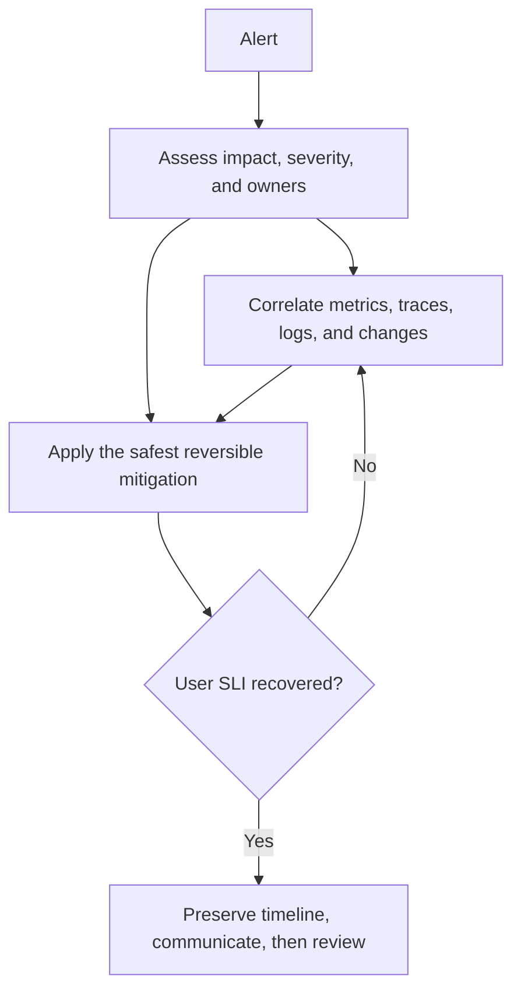

服务上线后，运行证据需要回答四个问题：用户是否受影响、影响范围多大、原因可能在哪、当前应先做什么。**可观测性、SLO 与故障响应**把运行状态组织成可查询、可判断、可恢复的证据链。缺少这些机制时，团队只能翻找零散日志，告警也容易停留在 CPU、内存等资源阈值上。

本章以“订单创建 API”说明这些概念。用户请求先经过网关、订单服务、PostgreSQL、支付服务与消息队列。某天 P99 延迟从 400 ms 升到 8 s，成功率下降。我们需要先判断这是否真的影响用户，再用指标缩小范围、用 Trace 定位跨服务等待、用日志解释某一请求，最后采取止血措施并复盘，而不是从海量日志中搜索“error”。

## 10.1 从遥测数据看见运行中的系统

**遥测数据（telemetry）**是系统主动或被动产生的运行信号。最常见的三类是日志、指标和 Trace；**profiling（性能剖析）**则在需要时采集函数、CPU、内存或锁等待的细粒度样本。OpenTelemetry 是与厂商无关的开源可观测性框架，用于生成、收集与导出 traces、metrics、logs 等数据；它不等于某个存储产品，而是一套仪表化和数据语义的共同语言。[OpenTelemetry 文档](https://opentelemetry.io/docs/)对此有清楚定义。

**日志（log）**记录离散事件的详细上下文，适合回答“订单 `o_9812` 为什么失败”“下游返回了什么业务错误”。日志应当结构化：每条记录用固定字段而非仅一段可读句子，便于检索、聚合和脱敏。例如：

```json
{
  "timestamp": "2026-08-05T09:30:12.316Z",
  "severity": "ERROR",
  "service.name": "order-api",
  "trace_id": "4bf92f...",
  "span_id": "00f067...",
  "request_id": "req_8a1",
  "order_id": "o_9812",
  "event": "payment_failed",
  "error.type": "UpstreamTimeout",
  "http.status_code": 504
}
```

字段名应稳定，错误类型应是有限集合，时间应使用带时区的 UTC instant。`request_id` 由入口生成并贯穿本服务，`trace_id` 把跨服务的一次请求联系起来，`order_id` 只在确有权限和保留策略时记录。日志里绝不能写密码、访问令牌、完整银行卡号、完整请求体或未脱敏个人信息。结构化不等于把所有对象序列化：字段过大、敏感或高基数会增加存储、索引与查询成本；是否记录取决于诊断价值、访问控制和保留策略。

**指标（metric）**把大量事件压缩为随时间变化的数字序列，适合回答“过去五分钟错误率是多少”“队列是否积压”“P95 是否越过目标”。常见类型包括：只增不减的**计数器**，如 `http_requests_total`；可上下浮动的 **Gauge（瞬时值/仪表）**，如当前连接数；记录分布的**直方图（histogram）**，如请求时延。指标名称描述被测量的东西，标签描述有限维度，例如 `route`、`method`、`status_class`、`region`。不要把 `user_id`、`request_id`、完整 URL、订单号放进 Prometheus 标签：每个不同值都会形成新的时间序列，称为高基数，可能使采集、内存与查询成本失控。详细身份放日志和 Trace，聚合维度放指标。

**Trace（分布式追踪）**描述一个请求在多个组件中经历的因果路径。一个 trace 由多个 span 组成：网关 span 是父节点，订单服务、数据库查询、支付 HTTP 调用可成为子节点；每个 span 有开始时间、持续时间、状态和属性。Trace 特别适合判断 8 秒花在哪里：是网关排队、数据库锁等待、支付服务慢，还是消息发布阻塞。OpenTelemetry 的 tracer 会为一次操作创建 span，并由 exporter 交给 Collector 或后端；[Trace 概念文档](https://opentelemetry.io/docs/concepts/signals/traces/)说明了这些边界。采样很重要：若要优先保留错误 trace 和慢请求 trace，需要在 Collector 或后端实施 **tail sampling**，按最终状态和总时延决定是否导出；高流量正常请求可按比例采样。仅用入口处的 head sampling 不能保证所有错误或慢 trace 都被保留，采样规则也要监控自身的丢弃率和资源消耗；否则成本会随着流量线性膨胀，反而使查询不可用。

**性能剖析（profiling）**不是第四种日志。它在一段时间内采样或记录 CPU 正在执行哪些函数、内存由谁分配、线程在等待什么锁等。指标告诉你 CPU 达到 95%，Trace 告诉你订单服务这段慢，profile 才可能显示 JSON 编码占了 60% CPU 或某个全局锁竞争严重。profile 成本和隐私风险通常更高，适合按需、短时间、受控地开启；不要把每个请求的函数级细节永久保存。

### 高频辨析：日志、指标、Trace 与 Profiling

日志给出**单个事件的细节**，指标给出**整体趋势和数量**，Trace 给出**一次跨组件请求的路径**，profile 给出**进程内部资源消耗的细节**。订单失败率上升时，先用指标确认范围和时间；选一条慢 trace 看它卡在哪个依赖；再按 `trace_id` 查结构化日志读错误上下文；若 CPU 已饱和但原因不明，短时间 profile。把所有问题都交给日志搜索会慢且昂贵；只看指标又难以解释一条用户投诉。

### 高频辨析：监控与可观测性

**监控（monitoring）**通常围绕已知问题和预设阈值回答“磁盘满了吗、错误率高了吗”；**可观测性（observability）**强调系统能否从外部输出推断内部状态，并能提出事先没有准备好的问题，例如“只有日本区域、支付方式为 X 的订单为什么变慢”。二者不是替代关系：仪表盘和告警属于监控，也是可观测性体系的一部分；结构化事件、关联 ID、统一语义和可探索查询让未知问题也有证据可查。OpenTelemetry 将可观测性表述为通过 traces、metrics、logs 等输出理解系统内部状态的能力，[其 primer](https://opentelemetry.io/docs/concepts/observability-primer/)尤其强调处理未知问题的价值。

## 10.2 延迟分布、直方图与黄金信号

用户感受到的是一次请求的延迟，而不是服务的平均延迟。假设 99 个订单在 100 ms 完成，1 个订单因支付超时花了 10 s，平均值约 199 ms，看似健康；那位等待 10 s 的用户并不觉得系统只有 199 ms。**百分位数（percentile）**从分布看延迟：P50（中位数）表示一半请求不超过该值，P95 表示 95% 请求不超过该值，P99 关注最慢的 1%。P99 不等于“最慢的那一个”，也不表示每 100 个连续请求中刚好有一个慢；它依赖统计窗口、样本数与聚合范围。由原始样本得到的是经验分位数；由 histogram 计算的分位数是按 bucket 分布插值得到的估算，精度取决于 bucket 或分辨率。

服务应以**直方图**记录时延分布，而不是只上报平均值。下文所说的累计上界 bucket 是 classic histogram 的表示：观察值落到不超过 50 ms、100 ms、250 ms、1 s、5 s 的 bucket 中，后端可对多个实例的 bucket 相加，再估算整体百分位数。Prometheus 也支持 native histogram，它使用动态 bucket 与不同的存储形式。Prometheus 的 histogram 和 summary 都记录观察值、总和与次数；前者适合跨实例聚合，后者在客户端预先计算 quantile，通常不能把多个实例的 quantile 正确合并。[Prometheus 的官方说明](https://prometheus.io/docs/practices/histograms/)和[指标类型文档](https://prometheus.io/docs/concepts/metric_types/)都强调了这个差异。bucket 要围绕用户目标设计：若使用 **classic histogram** 且 SLO 是“99% 请求不超过 300 ms”，应配置 300 ms 的 bucket，才能准确计算达标比例；只有 100 ms 和 10 s 两个 bucket 无法判断。若使用 native histogram，应选择足够分辨率，并把由插值带来的估计误差写入指标约定。

不要把“P99 很高”直接归因于代码慢。先确认窗口是否只有几十个请求、是否被健康检查或批处理污染、是否按 route/region/status 分组后才暴露问题。还要区分服务端成功延迟和用户端端到端延迟：CDN、DNS、客户端网络与前端渲染都可能影响后者。对失败请求也应测延迟，因为“很快返回 500”与“等 30 秒后超时”对排障含义不同。

Google SRE 提出的**四个黄金信号**是检查用户服务的简洁起点：**延迟（latency）**、**流量（traffic）**、**错误（errors）**和**饱和度（saturation）**。延迟需区分成功与失败；流量可以是请求数、事务数或字节数；错误是显式失败、无效内容或违反业务承诺的结果；饱和度是最紧缺资源接近上限的程度，如队列积压、连接池等待、磁盘 I/O 或 CPU run queue，而不只是“CPU 使用率”。[Google SRE 的《Monitoring Distributed Systems》](https://sre.google/sre-book/monitoring-distributed-systems/)将这四项作为用户服务最优先的信号。

### 高频辨析：P50、P95 与 P99

P50 描述典型体验，P95 暴露较慢尾部，P99 对极慢请求最敏感。它们必须附带窗口、请求量、范围和成功/失败条件才有意义。P50 正常而 P99 恶化常意味着少数依赖、热点分区、重试或 GC 造成长尾；P99 在只有两条样本时可以计算，但会极不稳定，通常不足以支持可靠告警或 SLO 判断，必须同时查看样本量和窗口。选择哪一个做 SLO 取决于用户承诺：普通列表可看 P95，支付确认或交互式 Agent 回复可能更关心 P99，但不能为了指标好看而只报告 P50。

### 高频辨析：平均值与百分位数

**平均值**把所有值相加除以次数，适合总成本、总体吞吐推导等线性问题；**百分位数**回答某个体验阈值覆盖了多少请求，适合延迟目标。平均值不能推出 P95/P99：许多完全不同的分布可以有同一个平均值。反过来，百分位数也不能直接相加或平均；不能把十台机器各自的 P99 再取平均当作服务 P99。应从可聚合的直方图 bucket 合并后计算，或在单一后端按原始样本/分布查询。

## 10.3 从 SLI 到错误预算

可靠性不是无限追求 100% 可用。用户也许能接受极少数请求失败，却不能接受每周多次支付中断；团队若没有共同目标，就无法判断该优先发布新功能还是暂停变更修复稳定性。**SLI（service level indicator）**是精确定义的服务质量测量，例如“过去 28 天内，所有经过身份验证且请求格式有效的 `POST /orders` 请求中，返回 2xx/202、并可读取相应订单状态的比例”。在这个定义中，无效参数等客户端 4xx 不进入分母；服务错误地拒绝一个本来有效的请求，或返回 5xx/超时，则是不良事件。它必须说明分子、分母、数据来源、窗口、排除条件和聚合方式；“可用性很好”不是 SLI。

**SLO（service level objective）**是 SLI 的目标，例如“过去 28 天订单创建可用性至少 99.9%”，“99% 成功订单创建在 300 ms 内完成”。可用性 SLI 常写成 `good_events / valid_events`；延迟 SLI 可写成“低于阈值的成功事件 / 有效事件”。**SLA（service level agreement）**是对客户或合作方的外部合同承诺，常包含测量定义、责任边界、服务抵扣或违约后果。内部 SLO 通常应比 SLA 严格，给团队留下缓冲；没有合同也完全可以有 SLO。

若四周内有 1,000,000 个有效订单创建请求，99.9% 可用性 SLO 允许 0.1%，即 1,000 个不良事件；这 1,000 个就是**错误预算（error budget）**。预算不是“可以故意让 1,000 个请求失败”的配额，而是产品可靠性与变更速度之间的控制信号。预算消耗很快时，应停止高风险发布、加快回滚、排查共同依赖并优先做可靠性工作；预算健康时，可承受受控实验和正常发布。预算**比例**是 `1 - SLO`，将它乘以窗口中有效事件数才得到预算数量；按时间计算的 SLI 则以允许的不可用时间表示。Google SRE 的 SLO 文档与错误预算策略要求团队事先约定预算耗尽后采取什么行动。[SLO 定义](https://sre.google/sre-book/service-level-objectives/)和[错误预算策略示例](https://sre.google/workbook/error-budget-policy/)可作为写目标的参考。

SLO 必须面向用户而非机器。CPU 低于 80% 是容量信号，不是用户体验目标；数据库磁盘余量是风险指标，不直接等于订单是否能完成。也不要照抄“99.99%”：目标越高，允许的月度失败时间越少，架构、成本和运维复杂度越高。先选一条关键用户旅程、可可信测量的 SLI、合理窗口与阈值，再同产品、开发和运维一起确认目标与预算政策。

### 高频辨析：SLI、SLO 与 SLA

SLI 是**测量值**，如成功请求比例；SLO 是团队希望达到的**目标**，如 28 天内至少 99.9%；SLA 是面向外部的**协议/承诺**，可能附带赔偿。把 99.9% 直接叫 SLI 或 SLA 都不严谨。一个成熟答案还会说明错误预算：它是目标允许的不良事件空间，用于约束变更节奏，而不是单纯的运维 KPI。

### 高频辨析：错误率与错误预算消耗速度

错误率是某个短窗口内坏事件占比，例如过去 5 分钟 2%；错误预算消耗速度（burn rate）把当前错误率与**同一 SLO 允许的错误率**比较：`burn rate = 当前窗口的坏事件率 / SLO 允许的坏事件率`。99.9% SLO 的允许错误率是 0.1%，若当前为 2%，消耗速度约为 20 倍：若持续下去会很快耗尽长窗口预算。短窗口可快速发现爆发，长窗口可避免瞬时抖动误报；二者结合比单一“错误率超过 1% 就报警”更贴近用户影响。低流量服务一次失败就可能得到极高 burn rate，通常还要配合最小样本量、合成流量或人工分级策略。告警阈值和窗口必须按业务流量、SLO 窗口和可处理性校准。

## 10.4 仪表盘、告警与关联查询

**仪表盘（dashboard）**是帮助人理解状态和趋势的界面。它应围绕一个问题组织，而不是堆几十张“也许有用”的图：订单 API 总览可放流量、成功率、P50/P95/P99、队列年龄、关键依赖和预算剩余；数据库面板可放连接池等待、慢查询、锁等待和 I/O；发布面板可把版本、错误率和延迟叠在同一时间轴。每张图都要标出单位、时间范围、过滤条件和所有者。仪表盘不应依赖告警发生后才临时拼凑，但也不能替代行动明确的通知。

**告警（alert）**要求某个角色在规定时间内采取行动。一个好的页面告警应回答：哪个用户可见目标受损、影响范围、严重级别、何时开始、当前值与阈值、关联仪表盘、最近发布，以及第一步 runbook。CPU 90% 但用户无影响时通常是工单或容量信号；预算以极快速度消耗、支付成功率持续下降才可能需要唤醒值班。Google SRE 建议从用户体验的 SLO 推导可行动告警，而非对每一个内部指标都分页；[SLO 告警章节](https://sre.google/workbook/alerting-on-slos/)详细解释了这一思路。Prometheus 的 alerting rules 只负责根据表达式产生活跃告警并发给外部通知组件，规则本身不会替团队判断根因或修复故障。[官方文档](https://prometheus.io/docs/prometheus/latest/configuration/alerting_rules/)说明了这一边界。

告警噪声会让人产生告警疲劳，真正事故反而被忽略。应合并同一根因的重复通知、用 `for`、多窗口 burn rate、去重/抑制和合适分组来减少无行动价值的通知；这些手段会牺牲一部分检测速度，阈值应按可接受影响校准。相反，不能因为怕噪声而把所有告警改成日报：快速消耗预算、数据丢失、安全事件和付款失败需要及时人工响应。定期审查每条告警：它是否真的触发过行动，接到的人是否有权限处理，若不处理会怎样，是否能由自动化安全缓解。

### 高频辨析：告警与仪表盘

仪表盘用于**探索、理解和沟通**，允许人主动查看多维趋势；告警用于**唤醒并驱动行动**，必须少、准、带责任和 runbook。把每张图的阈值都做成页面告警会制造噪声；只做告警、不做趋势图又会使响应者无法判断是否扩散或恢复。最好的告警链接到能回答“影响、时间、范围、依赖和下一步”的仪表盘。

## 10.5 故障响应、分级与无责复盘

**故障（incident）**是正在或可能正在影响用户、数据安全或关键业务目标的事件，不等于某条异常日志。响应的首要目标是减少影响，不是立刻证明谁写错了代码。一个实用的流程是：确认用户影响和严重级别；指定 incident commander（协调决策）与 communications（对内对外更新）角色；建立单一事件频道和时间线；先做可逆的缓解，如回滚、关闭高风险功能开关、限流、切流或扩容；持续观察 SLI；稳定后再深入根因。小团队一个人可兼任多个角色，但“谁在协调、谁在操作、谁在沟通”仍应明确。



严重级别应按影响定义，而非按“系统看起来多复杂”。例如支付完全不可用、数据可能错误或大量客户受影响可为最高级；单一区域部分慢请求可为中等级；后台报表延迟但用户无直接影响可为低等级。上述只是示例：具体阈值、业务范围和法规义务由团队预先定义，数据泄露、重复扣款或安全事件也可能是最高优先级。级别要预先规定通知对象、响应时限、更新频率和升级路径。不要等到根因查清才向用户或业务方更新：可以诚实地说明“我们确认订单创建失败率升高，正在回滚 09:20 的发布，下一次更新在 15 分钟后”，而不是猜测尚未验证的原因。

恢复后写**无责复盘（blameless postmortem）**。无责不表示没有责任或不改流程，而是把注意力放在当时的人为何会做出合理选择、系统为何允许单个错误扩大，而不是用事后信息指责个人。复盘至少包括影响、检测方式、时间线、触发条件、加剧因素、根因、哪些缓解有效、哪些无效、行动项及其负责人与截止时间。行动项应具体且可验证，例如“为支付超时加入 provider 幂等键并增加重复回调回归测试”，而不是“提高警惕”。若行动项不进入正常规划并被跟踪，复盘只会成为文档仪式。

### 高频辨析：症状、触发条件与根因

**症状**是观察到的影响，如 P99 升高、用户收到 502；**触发条件**是让这次故障开始的事件，如新版本开启了 N+1 查询；**根因/系统性促成因素**是使系统在该触发下无法正确承受影响的更深层缺陷，例如没有查询上限、连接池无背压、没有发布前性能保护。复杂事故往往有多项促成因素，不应强行归结为一个人或一行代码。回滚能移除触发并快速止血，却未必修掉根因；根因分析也不能延误止血。复盘应把三者分开写，避免一句“数据库慢了”同时充当现象和解释。

### 高频辨析：故障处理与复盘

故障处理发生在影响仍在扩大或尚未完全恢复时，目标是**恢复服务并保持沟通**；复盘发生在稳定后，目标是**学习并减少复发**。响应中可以先回滚再研究，复盘中不能用“已回滚”代替行动项。把每次事故都变成追责会减少报告意愿；把复盘变成没有负责人和验证标准的经验分享，又不会提高可靠性。

## 10.6 容量规划与性能调试

性能调试先从用户症状开始，再沿黄金信号和依赖链缩小：错误率是否上升、延迟是所有 route 还是一个 route、流量是否突然变化、饱和的是 CPU、连接、队列还是下游配额。以指标确认影响范围后，慢 trace、关联日志以及发布/依赖对比可以并行开展；profile 或数据库执行计划只在 CPU、锁或分配成为合理假设时开启，用来解释资源为何饱和。不要一看到慢就加机器：若根因是锁竞争、热点分区、N+1 查询或无限重试，扩容可能无效甚至把下游压垮。

三个常被混淆的量是：**吞吐（throughput）**，单位时间完成的请求/任务数；**并发（concurrency）**，某一时刻正在处理或尚未完成的请求数；**延迟（latency）**，单个请求从开始到完成所花时间。在同一系统边界、长期稳定且平均到达率等于完成率时，Little 定律为 `L = λW`，即并发量约等于完成吞吐乘平均延迟。每秒完成 100 个请求、平均 0.2 秒时，在途请求约 20；若完成吞吐不变而平均延迟升到 2 秒，在途请求约 200，会进一步挤满线程、连接和队列。这个式子用于量级判断，不取代实际分布与容量测试。

容量规划需要明确服务的资源和限制：实例 CPU/内存、数据库连接上限、磁盘 IOPS、消息消费速率、第三方配额、网络带宽和冷热数据比例。用接近真实的流量形状压测，而不是只发送固定的成功请求：包含峰值、慢依赖、错误重试、不同请求大小和真实读写比例。结果要记录版本、数据规模、硬件、配置、缓存冷热状态、数据库统计信息、第三方是桩还是真实沙箱，以及失败条件；“压到 1 万 QPS”没有说明延迟、成功率和资源余量就不可比较。为未来增长留余量，也为突然依赖变慢预留过载保护：限流、有界队列、超时、熔断、降级与扩容策略。

### 高频辨析：吞吐、并发与延迟

吞吐是“每秒做多少”，并发是“同时有多少尚未完成”，延迟是“一个要等多久”。提高并发上限有时能提高吞吐，但若 CPU、数据库或下游已饱和，只会让排队和尾延迟更高；降低延迟通常会在相同吞吐下减少所需并发。面试题若问“线程池调大为什么更慢”，应回答：线程越多不等于资源越多，排队、上下文切换、锁竞争和下游连接耗尽都会把延迟推高。

### 高频辨析：利用率与饱和度

**利用率**是资源当前被使用的比例，例如 CPU 75%；**饱和度**是工作开始排队、等待或被拒绝的程度，例如 run queue 增长、连接池等待、消息最老年龄变大。高利用率未必有问题：CPU 持续 80% 但延迟稳定可能健康；低平均利用率也可能有单核热点或突发排队。容量告警应尽量观测饱和后果和资源余量，而不是只用一个全局 CPU 百分比。

## 10.6.1 遥测数据模型：相关性、基数与采样决定数据能否使用

可观测性不是“所有地方都打印更多日志”。每条遥测数据至少要能回答来源、时间、结果与关联关系。资源属性描述发出数据的服务、实例、区域和版本；HTTP、数据库、消息等操作采用一致的名称和字段，才能跨团队聚合。分布式 Trace 通过上下文传播把入口 span、数据库调用、下游 HTTP 与异步消息的因果关系连起来；如果请求 ID 只留在入口日志、没有随 Header 或消息元数据向下传递，出现跨服务慢请求时仍只能靠时间猜测。异步消费应传播创建消息时的追踪上下文，并同时记录消息 ID、尝试次数和业务关联 ID；不要把完整令牌、请求体或用户隐私塞进 span 属性。

**标签基数（cardinality）**决定指标系统能否承受。`http_requests_total{route="/orders/:id",status="200"}` 的标签组合有限，适合按路由聚合；把原始 user ID、request ID、完整 URL、异常文本或订单号作为标签，会为几乎每次请求创造新时间序列，导致内存、查询和成本失控。高基数信息应放入结构化日志或 Trace，必要时从延迟直方图的 exemplar 跳转到代表性 Trace。仪表盘中的“所有错误按 request_id 分组”也不是指标查询该做的事情。

采样是成本与诊断完整性的取舍。始终记录错误、高延迟、关键写操作和安全事件；对健康高流量路径可概率采样或尾部采样，但采样率必须可见，不能把“采到的 1% 都成功”直接当成真实成功率。用于 SLI 的计数器、延迟直方图和日志审计通常不能依赖随机 Trace 样本。日志需要有保留期、访问控制和脱敏规则；指标需定义单位、bucket 与标签约束；Trace 需定义传播、采样和跨租户隔离。三类数据的存储策略不同，却应围绕同一个用户影响和请求关联模型设计。

## 本章练习

1. 订单 API 的平均延迟保持 180 ms，P99 从 400 ms 升到 8 s，但错误率不变。列出从指标、Trace、日志到 profile 的排查顺序，并说明每一步要验证什么。

2. 为 `POST /orders` 写一条可用性 SLI、一个 28 天 SLO 和相应错误预算。定义哪些请求进入分母，哪些结果计为不良事件；说明为什么不能只看实例 CPU。

3. 某团队把 `user_id`、`request_id` 和完整 URL 都放入 Prometheus 指标标签。会发生什么问题？如何同时保留聚合能力和单请求诊断能力？

4. 午夜发布后，支付失败率在 10 分钟内升高到 3%，该服务的可用性 SLO 是 99.9%。写出一个合理的故障响应前 20 分钟动作，不要求猜出根因。

5. 十台订单服务各自上报 P99，团队取十个数字的平均值并声称这是全站 P99。为什么不正确？应采集和聚合什么数据？

6. 请求量从 100 QPS 增至 200 QPS，平均延迟从 200 ms 增至 2 s，线程池排队上升。用 Little 定律估算在途请求量变化，并给出两个不能只靠加线程解决的可能原因。

## 练习参考答案

1. 先按 route、区域、版本、状态码查看 P50/P95/P99、流量和饱和度，确认是全局问题还是一个分组的长尾，且排除低样本窗口。再筛选慢 trace，比较时间主要花在数据库、支付服务还是进程内排队；按 `trace_id` 查结构化日志，验证重试、错误类型、订单特征和下游状态。若 trace 指向进程内 CPU 或锁等待，再短时间开启 profile，寻找热点函数、分配或锁竞争。每一步都在缩小假设，不能从“P99 高”直接断言某行代码慢。

2. 例：SLI 为过去 28 天、已通过身份验证且请求格式有效的 `POST /orders` 中，返回非 5xx 且订单状态可读取的请求比例；SLO 为该比例至少 99.9%。若 28 天有 1,000,000 个有效请求，预算为 1,000 个不良事件。4xx 是否进入分母要按语义决定：无效参数通常不应消耗服务可用性预算，服务错误地把合法请求拒绝则应计入。CPU 只显示资源使用，不能说明用户是否成功创建订单，也不能涵盖下游支付、数据库或网络故障。

3. 每个不同 ID 或 URL 会创建新时间序列，高基数会增大采集端内存、存储和查询成本，甚至使监控系统自身不可用。指标标签只保留有限的 `route` 模板、状态类、区域和服务版本；把 request/order/user 身份写入有权限控制与脱敏的结构化日志和 Trace 属性。仪表盘用指标找异常范围，再从 trace/log 链接到单次请求。

4. 确认报警对应的用户 SLI、影响区域和开始时间，按预案宣布 incident、指定协调和沟通角色，建立时间线。立即暂停发布并回滚或关闭刚启用的高风险功能，同时观察错误预算消耗、支付成功率、延迟和队列积压。向业务和支持团队说明已确认的影响、正在采取的缓解措施和下一次更新时间；并行用 trace/log 比较新旧版本与下游错误。不要在未经验证前宣称“根因就是发布”，也不要等根因查明才回滚。

5. 百分位数不是可线性平均的指标：每台实例流量不同、分布不同，平均十个 P99 不能得到全站第 99 百分位。应采集各实例可合并的 histogram bucket，按目标 route/区域/状态先合并 bucket，再由合并后的分布估算 P99；或在后端对原始样本按统一窗口查询。还要报告样本量和窗口。

6. 原先在途量约为 `100 × 0.2 = 20`；变化后约为 `200 × 2 = 400`，约二十倍。这会使线程池和连接池排队迅速增大。可能原因包括数据库连接/锁或 I/O 饱和、下游支付服务变慢导致重试和在途请求堆积；也可能是 N+1 查询或热点分区。盲目加线程会增加上下文切换和对下游的并发压力，必须先确认瓶颈与背压策略。

## 延伸阅读与资料

- [OpenTelemetry Observability Primer](https://opentelemetry.io/docs/concepts/observability-primer/)、[Trace 概念](https://opentelemetry.io/docs/concepts/signals/traces/) 与 [Sampling](https://opentelemetry.io/docs/concepts/sampling/)：日志、指标、追踪与采样边界的官方起点。
- [Prometheus Histograms and Summaries](https://prometheus.io/docs/practices/histograms/) 与 [Metric types](https://prometheus.io/docs/concepts/metric_types/)：直方图、quantile、聚合与标签的基础。
- [Google SRE：Monitoring Distributed Systems](https://sre.google/sre-book/monitoring-distributed-systems/)：四个黄金信号。
- [Google SRE：Service Level Objectives](https://sre.google/sre-book/service-level-objectives/)、[Alerting on SLOs](https://sre.google/workbook/alerting-on-slos/) 与 [Error Budget Policy](https://sre.google/workbook/error-budget-policy/)：SLI、SLO、错误预算和可行动告警。
- [Prometheus Alerting rules](https://prometheus.io/docs/prometheus/latest/configuration/alerting_rules/)：告警规则的职责边界。
